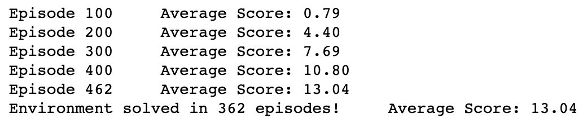
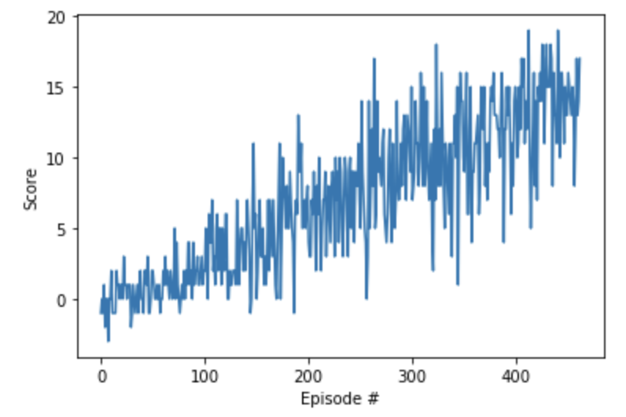

[//]: # (Image References)

[image1]: https://user-images.githubusercontent.com/10624937/42135619-d90f2f28-7d12-11e8-8823-82b970a54d7e.gif "Trained Agent"

# Deep Reinforcement Learning Project : Banana Collector Agent

### Introduction

For this project, i  train an agent to navigate (and collect bananas!) in a large, square world.  

![Trained Agent][image1]

A reward of +1 is provided for collecting a yellow banana, and a reward of -1 is provided for collecting a blue banana.  Thus, the goal of your agent is to collect as many yellow bananas as possible while avoiding blue bananas.  

The state space has 37 dimensions and contains the agent's velocity, along with ray-based perception of objects around agent's forward direction.  Given this information, the agent has to learn how to best select actions.  Four discrete actions are available, corresponding to:
- **`0`** - move forward.
- **`1`** - move backward.
- **`2`** - turn left.
- **`3`** - turn right.

The task is episodic, and in order to solve the environment, your agent must get an average score of +13 over 100 consecutive episodes.

### Getting Started

Before to start, create your environment using 'requirements.txt'
 `$ pip install -r requirements.txt `

Before to start you need to set the path of Banana env file:
- **Ubuntu server** (x86, headless) : I trained the model using distant Ubuntu server with GPU, that's why i used `"Banana/Banana_Linux_NoVis/Banana.x86_64"`
- **Mac**: to visualise the result using Graphic interface i used my Mac that's why i selected `"Banana.app"`

```
env = UnityEnvironment(file_name="FILE")
```

I created the code so that the agent is able to use its experience to gradually choose better actions when interacting with the environment!
I created our own agent to solve the environment!

I trained the model with 2000 episodes.
- I save `final_checkpoint` in the end
- I save `checkpoint` when first time we reach > 13 reward

## Code implementation

I got the start code from "Lunar Lander" first project using Deep Reinforcement Learning from [Deep Reinforcement Learning Nanodegree](https://www.udacity.com/course/deep-reinforcement-learning-nanodegree--nd893),
Then:
- I changed from using Gym env to Udacity ML-Agent env.
- I adjusted for being used with the banana environment.

My code consist of :

### model.py :
I implimented PyTorch QNetwork class. Regular fully connected Deep Neural Network. The input is 37 as we have 37 dimensions, and the output action are 4, the 4 movement. 

### dqn_agent.py :
A DQN agent and a Replay Buffer memory used by the DQN agent.

### Navigation.ipynb : 
Jupyter notebooks of the main project, used to train the model and plot and test the results.
Steps:
  - Import resources Packages 
  - Test the State and Action Spaces
  - Test Random Actions 
  - Train an agent using DQN
  - Plot the scores

# RESULTS:



# Need to be added :
Improve training using :
- Double DQN
- Prioritized Experience Replay
- Dueling DQN
